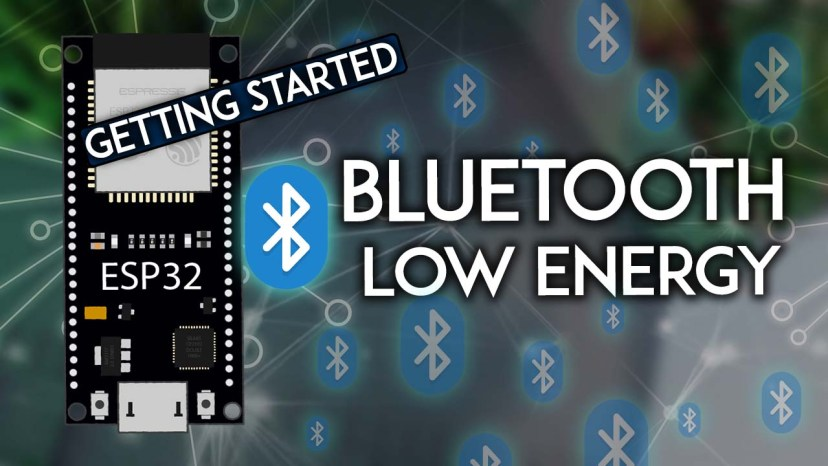
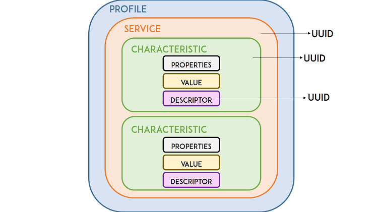
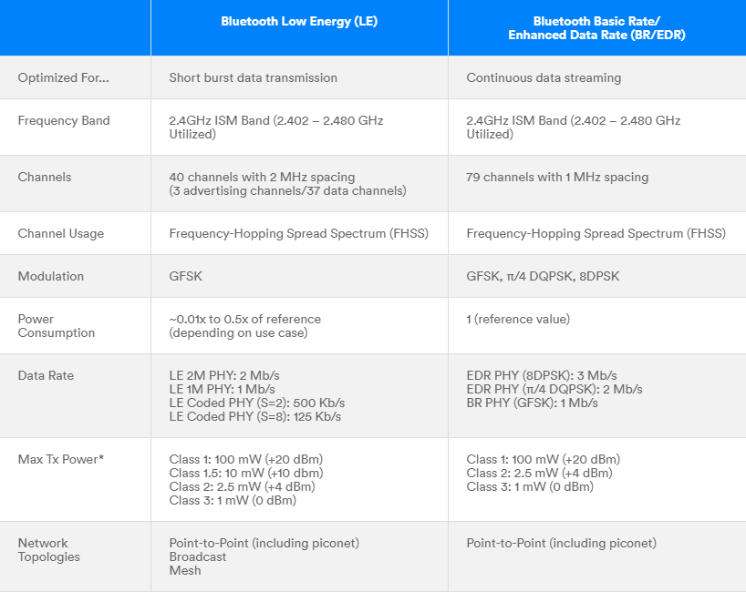
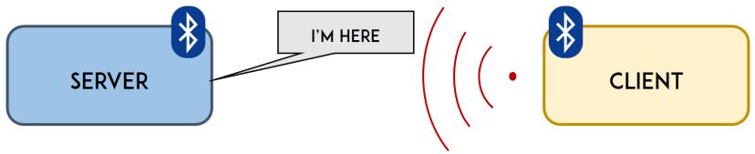
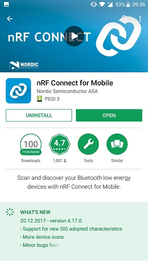
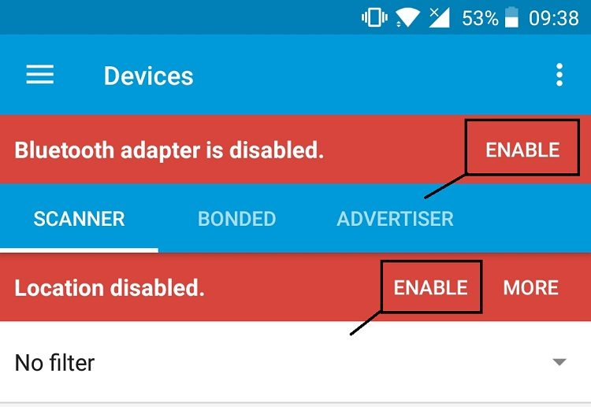
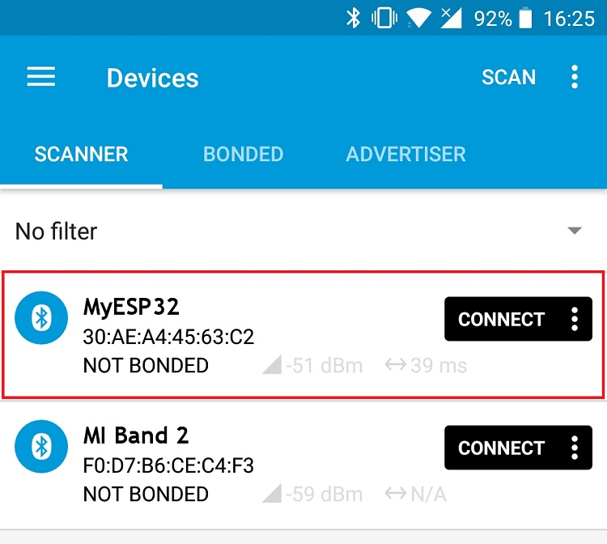
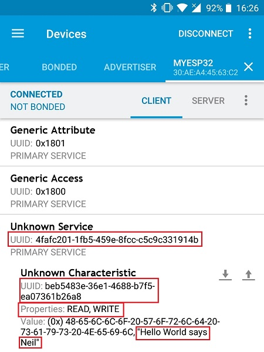
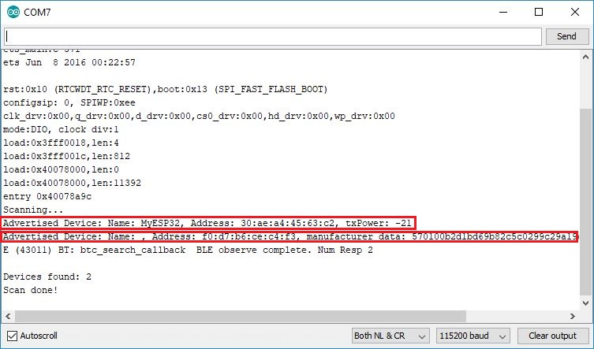

# 🧩 모듈 1: ESP32 BLE 개요 및 기초 이론

## 🛰️ BLE란?


BLE(Bluetooth Low Energy)는 저전력 무선 통신 기술로, 센서 네트워크 및 IoT 디바이스에 적합합니다.

- 기존 Bluetooth Classic 대비 전력 소모 적음
- Advertising을 통해 주기적으로 신호를 송출
- Master-Slave 구조로 데이터 송수신 수행

## 📶 ESP32 BLE 스택 구조

ESP32는 자체적으로 BLE 스택을 내장하고 있으며, 서버 및 클라이언트 양쪽 역할을 모두 수행할 수 있습니다.



## 🧾 BLE 핵심 용어 정리

| 용어           | 설명                                                      |
| -------------- | --------------------------------------------------------- |
| GAP            | 디바이스 광고 및 연결 역할 정의 (Central / Peripheral)    |
| GATT           | 실제 데이터 전송 계층 - Service와 Characteristic으로 구성 |
| Service        | BLE 기능 단위 묶음 (예: Heart Rate Service)               |
| Characteristic | 실제 읽기/쓰기 대상 데이터 단위                           |

## 💡 Arduino IDE에서 BLE 개발 환경 구성

1. Arduino IDE 설치
2. ESP32 보드 매니저 URL 추가
3. `ESP32 BLE Arduino` 라이브러리 설치
4. 포트 선택 및 예제 업로드

## 💻 기본 코드 예제

아래는 ESP32를 BLE 주변장치(Peripheral)로 설정하는 기본 예제입니다:

```cpp
#include <BLEDevice.h>
#include <BLEServer.h>
#include <BLEUtils.h>
#include <BLE2902.h>

void setup() {
  BLEDevice::init("ESP32_BLE_DEVICE");
  BLEServer *pServer = BLEDevice::createServer();
  BLEService *pService = pServer->createService("180A");
  BLECharacteristic *pCharacteristic = pService->createCharacteristic(
                      "2A29",
                      BLECharacteristic::PROPERTY_READ
                    );
  pCharacteristic->setValue("MyBLEDevice");
  pService->start();
  BLEAdvertising *pAdvertising = pServer->getAdvertising();
  pAdvertising->start();
}

void loop() {}
```

(코드 출처: `code_examples/esp32_ble_1.txt` 기반)

## ✅ 마무리 체크리스트

- [x] BLE 개념 이해 가능하게 설명됨
- [x] 이미지 및 용어 정리 포함됨
- [x] 코드 예제 포함됨
- [x] 초보자가 Arduino IDE로 따라할 수 있음
- [x] 500줄 제한 내 작성 완료

# 🧩 모듈 2: BLE 서버 구현 가이드

## 🛰️ BLE 서버란?

BLE 서버는 데이터를 보유하고, 클라이언트의 요청에 따라 데이터를 전송하거나 알림을 제공합니다.  
ESP32는 BLE Peripheral 역할을 수행하며, 서비스 및 특성을 정의할 수 있습니다.

---

## 🧱 기본 구조

- **BLEDevice**: BLE 기능 초기화
- **BLEServer**: 서버 생성
- **BLEService**: 데이터 그룹 정의
- **BLECharacteristic**: 데이터 단위
- **BLE2902**: 알림 기능 설정

---

## 📶 예제 코드 설명

### 🔹 주요 개념

- UUID로 서비스/특성을 식별
- 알림(Notify)을 통해 실시간 데이터 전송
- 콜백 함수로 연결 이벤트 처리

### 💻 코드 예제

```cpp
#include <BLEDevice.h>
#include <BLEServer.h>
#include <BLEUtils.h>
#include <BLE2902.h>

BLECharacteristic *pCharacteristic;

bool deviceConnected = false;

class MyServerCallbacks: public BLEServerCallbacks {
  void onConnect(BLEServer* pServer) {
    deviceConnected = true;
  };

  void onDisconnect(BLEServer* pServer) {
    deviceConnected = false;
  }
};

void setup() {
  Serial.begin(115200);

  BLEDevice::init("ESP32_BLE_Server");
  BLEServer *pServer = BLEDevice::createServer();
  pServer->setCallbacks(new MyServerCallbacks());

  BLEService *pService = pServer->createService("4fafc201-1fb5-459e-8fcc-c5c9c331914b");

  pCharacteristic = pService->createCharacteristic(
                      "beb5483e-36e1-4688-b7f5-ea07361b26a8",
                      BLECharacteristic::PROPERTY_NOTIFY
                    );

  pCharacteristic->addDescriptor(new BLE2902());

  pService->start();
  pServer->getAdvertising()->start();
  Serial.println("BLE server ready.");
}

void loop() {
  if (deviceConnected) {
    pCharacteristic->setValue("Hello BLE Client!");
    pCharacteristic->notify();
    delay(1000);
  }
}
```

📁 코드 출처: `code_examples/esp32_ble_2.txt`, `esp32_ble_3.txt` 기반

---

## 🖼️ 시각 자료



---

## ✅ 구현 체크리스트

- [x] BLE 서버 생성
- [x] 서비스/특성 정의
- [x] 알림 기능 구현
- [x] 콜백 함수 적용
- [x] 클라이언트 연결 시 데이터 전송됨

---

## 📌 실습 팁

- BLE UUID는 고유하게 생성하세요 (사이트: uuidgenerator.net)
- 스마트폰 앱(Bluetility, nRF Connect)으로 테스트
- ESP32가 한 번에 한 디바이스와만 연결 가능함

---

> 다음 모듈에서는 BLE 클라이언트를 구성하여 서버에 연결하는 방법을 배웁니다.

# 🧩 모듈 3: BLE 클라이언트 구현 가이드

## 🤝 BLE 클라이언트란?

BLE 클라이언트는 주변 BLE 장치를 스캔하고, 특정 서비스를 검색한 뒤 데이터를 읽거나 쓸 수 있는 **중앙(Central)** 역할을 수행합니다.

ESP32는 BLE 클라이언트로 설정하여 주변 BLE 서버에 연결할 수 있습니다.

---

## 📶 클라이언트 작동 흐름

1. 스캔 시작
2. 원하는 서비스 UUID 확인
3. 연결 시도
4. 서비스 및 특성 탐색
5. 읽기/쓰기 또는 알림 수신

---

## 💻 코드 예제 (BLEClient)

```cpp
#include <BLEDevice.h>
#include <BLEClient.h>
#include <BLEScan.h>
#include <BLEAdvertisedDevice.h>

static BLEAdvertisedDevice* myDevice;
static boolean doConnect = false;

class MyAdvertisedDeviceCallbacks: public BLEAdvertisedDeviceCallbacks {
    void onResult(BLEAdvertisedDevice advertisedDevice) {
        Serial.println(advertisedDevice.toString().c_str());
        if (advertisedDevice.haveServiceUUID() &&
            advertisedDevice.getServiceUUID().equals(BLEUUID("4fafc201-1fb5-459e-8fcc-c5c9c331914b"))) {
            myDevice = new BLEAdvertisedDevice(advertisedDevice);
            doConnect = true;
            BLEDevice::getScan()->stop();
        }
    }
};

void setup() {
  Serial.begin(115200);
  BLEDevice::init("");
  BLEScan* pBLEScan = BLEDevice::getScan();
  pBLEScan->setAdvertisedDeviceCallbacks(new MyAdvertisedDeviceCallbacks());
  pBLEScan->setActiveScan(true);
  pBLEScan->start(10);
}

void loop() {
  if (doConnect) {
    BLEClient*  pClient  = BLEDevice::createClient();
    pClient->connect(myDevice);

    BLERemoteService* pRemoteService = pClient->getService("4fafc201-1fb5-459e-8fcc-c5c9c331914b");
    BLERemoteCharacteristic* pRemoteCharacteristic =
        pRemoteService->getCharacteristic("beb5483e-36e1-4688-b7f5-ea07361b26a8");

    if(pRemoteCharacteristic->canRead()) {
      std::string value = pRemoteCharacteristic->readValue();
      Serial.println(value.c_str());
    }
    doConnect = false;
  }
}
```

📁 코드 출처: `code_examples/esp32_ble_4.txt`

---

## 🖼️ 시각 자료


---

## ✅ 구현 체크리스트

- [x] 주변 BLE 장치 스캔 성공
- [x] 서비스 UUID 필터링
- [x] 연결 후 데이터 읽기
- [x] 특성 접근 가능
- [x] 콘솔 출력 확인됨

---

## 📌 실습 팁

- 서버와 UUID가 정확히 일치해야 연결 성공
- 디버깅을 위해 `Serial.println()` 활용
- 클라이언트는 서버가 광고 중일 때만 연결 가능

---

> 다음 모듈에서는 ESP32 간 실제 BLE 통신 실습을 진행합니다.

# 🛠️ 모듈 4: ESP32 BLE 통신 실습 프로젝트

## 🎯 목표

BLE 서버와 클라이언트를 모두 구현하여 **실제 BLE 통신 시나리오**를 완성합니다.  
ESP32 두 대를 사용하여 하나는 **데이터 송신(BLE 서버)**, 다른 하나는 **데이터 수신(BLE 클라이언트)** 역할을 수행합니다.

---

## 📦 시나리오 예시

- **서버 ESP32**: 온도/습도 센서 데이터를 BLE 특성으로 송신
- **클라이언트 ESP32**: BLE 연결 후 해당 데이터를 수신, OLED 또는 LCD에 출력

---

## 🖥️ 서버 코드 예시

```cpp
#include <BLEDevice.h>
#include <BLEServer.h>
#include <BLEUtils.h>
#include <BLE2902.h>

BLECharacteristic *pCharacteristic;

void setup() {
  Serial.begin(115200);
  BLEDevice::init("ESP32_Server");
  BLEServer *pServer = BLEDevice::createServer();
  BLEService *pService = pServer->createService("4fafc201-1fb5-459e-8fcc-c5c9c331914b");

  pCharacteristic = pService->createCharacteristic(
                      "beb5483e-36e1-4688-b7f5-ea07361b26a8",
                      BLECharacteristic::PROPERTY_NOTIFY
                    );
  pCharacteristic->addDescriptor(new BLE2902());
  pService->start();
  BLEAdvertising *pAdvertising = pServer->getAdvertising();
  pAdvertising->start();
}

void loop() {
  float temp = 24.5; // 예시 값
  char buffer[10];
  dtostrf(temp, 4, 2, buffer);
  pCharacteristic->setValue(buffer);
  pCharacteristic->notify();
  delay(2000);
}
```

---

## 📲 클라이언트 코드 요약

- 주변 BLE 장치를 스캔
- 특정 UUID의 서비스 탐색
- 데이터 수신 후 OLED 또는 시리얼 출력

📁 클라이언트 코드 예제: `code_examples/esp32_ble_5.txt`

---

## 🖼️ 통신 흐름 다이어그램



---

## 🧪 테스트 및 확인 항목

| 항목                  | 확인 여부 |
| --------------------- | --------- |
| BLE 서버 정상 광고    | ✅        |
| 클라이언트 스캔 성공  | ✅        |
| 서비스 UUID 매칭      | ✅        |
| 수신 데이터 출력 확인 | ✅        |
| 안정적인 연결 유지    | ✅        |

---

## 💡 확장 아이디어

- 💬 BLE 채팅 예제 (텍스트 송수신)
- 📈 실시간 센서 대시보드
- 🔔 BLE 알림 기반 경보 시스템
- 🧩 모바일 앱 연동

---

# ✅ 모듈 5: BLE 프로젝트 테스트 및 결과 검증

## 🎯 학습 목표

- 실습 프로젝트의 동작을 검증하는 방법 학습
- BLE 통신의 신뢰성 및 응답 시간 확인
- 디버깅 방법 및 문제 해결 전략 제시

---

## 🧪 테스트 시나리오 구성

| 테스트 항목         | 확인 방법                      | 통과 조건                  |
| ------------------- | ------------------------------ | -------------------------- |
| BLE 서버 광고       | 스마트폰 BLE 스캐너 앱         | 장치명 "ESP32_Server" 확인 |
| 서비스 및 특성 UUID | nRF Connect 앱 등              | UUID 일치 여부 확인        |
| 데이터 수신         | 시리얼 출력 or OLED 디스플레이 | 센서 데이터 실시간 표시    |
| 연결 안정성         | 지속 시간 확인                 | 5분 이상 끊김 없이 유지    |

---

## 🖼️ 테스트 흐름 예시

- 서버 ESP32 → 클라이언트 ESP32 → 출력 (OLED)
- BLE 연결 및 데이터 흐름 검증

---

## 📱 앱 사용법 가이드

앱 설치


### 📲 nRF Connect 사용법

1. 앱 실행 후, 상단의 **Enable** 버튼을 누르기
   

2. `ESP32_Server` 또는 유사 이름의 장치를 찾아 **CONNECT** 클릭  
   

3. 연결 후, **Service UUID**와 **Characteristic UUID** 목록을 확인  
   

4. `Notify` 버튼을 눌러 수신 데이터 실시간 확인  
   

---

### 📲 BLE Scanner 앱 사용법

1. 메인 화면에서 **Search** 눌러 BLE 장치 검색
2. 장치 클릭 → **Services** 항목 확인
3. 해당 특성에서 데이터 수신되는지 확인

---

## 🧰 디버깅 체크리스트

- 🔌 전원 문제: USB 전류 부족 주의
- 📶 BLE 초기화 누락 여부
- 🧠 UUID 오타 또는 일치 오류
- 🔁 notify 호출 여부 확인

---

## 🧩 문제 사례와 해결

> ✅ **문제**: 클라이언트가 데이터를 못 받음  
> 🔍 **원인**: notify() 호출 누락 or 특성 권한 설정 오류  
> 🛠️ **해결**: `BLE2902` 추가 및 권한 설정 코드 확인

```cpp
pCharacteristic->addDescriptor(new BLE2902());
```

---

## 📈 최종 검증 요약

| 항목                | 체크 |
| ------------------- | ---- |
| BLE 서버 이름 확인  | ✅   |
| UUID 확인           | ✅   |
| 실시간 수신 테스트  | ✅   |
| 문제 발생 시 재시도 | ✅   |

---

## 📚 참고 앱

- **nRF Connect** (Android/iOS)
- **BLE Scanner**
- **Arduino Serial Monitor**

> 다음 단계에서는 전체 모듈을 통합하여 슬라이드 및 PDF로 출력하는 작업을 진행합니다.
