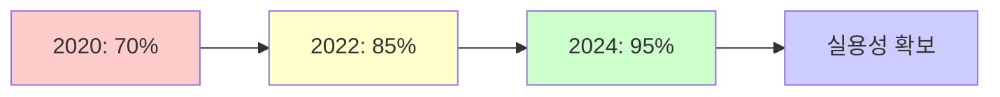

Human: The product is defective
Assistant: {"response": "I sincerely apologize for the defective product...", "sentiment": "negative", "action": "replacement"}

Now handle this customer:
Human: {user_input}
Assistant:
"""
```

---

### ⚡ **2022-2023: 폭발적 성장기**

```
ChatGPT (2022.11)
├── 기반: GPT-3.5 + RLHF
├── 특징: 대화 최적화, 사용자 친화적
├── 영향: 1억 사용자 2개월 달성
└── 비용: 초기 무료 → $20/월

GPT-4 (2023.3)
├── 파라미터: 추정 1.7T
├── 특징: 멀티모달, 추론 능력 향상
├── 성능: 변호사 시험 상위 10%
└── 비용: $0.03/1K 토큰
```

**🌪️ 업계 전체 변화:**
- 🔥 **AI 민주화**: 누구나 고급 AI 사용 가능
- 🔥 **프롬프트 엔지니어링 붐**: "새로운 프로그래밍 언어"
- 🔥 **파인튜닝 열풍**: "우리만의 GPT 만들기"
- 🔥 **스타트업 급증**: AI 서비스 창업 붐

---

### 🎯 **2024: 성숙기**

```
Claude 3, GPT-4 Turbo (2024)
├── 성능: 인간 수준 근접
├── 비용: 10배 이상 하락
├── 속도: 실시간 대화 가능
└── 접근성: 완전 대중화

Gemini, Llama 3 (2024)
├── 특징: 경쟁 격화
├── 오픈소스: 고성능 모델 공개
└── 다양성: 선택의 폭 확대
```

**💡 패러다임 재정립:**
```diff
+ 프롬프트 엔지니어링 → 자연스러운 대화
+ 파인튜닝 필수 → RAG/Tool Use 중심
+ 복잡한 설정 → 간단한 API 호출
+ 높은 진입장벽 → 누구나 접근 가능
```

---

## 📊 주요 변화 지표 분석

### 💰 **비용 변화**
```
2020년: GPT-3 API $0.02/1K 토큰
2022년: ChatGPT Plus $20/월 무제한
2024년: Claude/GPT-4 $0.003/1K 토큰 (7배 하락!)

파인튜닝 비용:
2021년: $100-1000/모델
2024년: $10-100/모델 (LoRA 등)
```

### ⚡ **성능 변화**
```
벤치마크 점수 (MMLU):
GPT-3 (2020): 43.9%
GPT-4 (2023): 86.4%
Claude 3.5 Sonnet (2024): 88.7%

추론 능력:
2020: 간단한 분류 작업
2024: 복잡한 멀티스텝 추론
```

### 🚪 **접근성 변화**
```
2020년: 연구소 + 대기업만
2022년: API 접근 가능
2024년: 스마트폰 앱으로 누구나

개발 복잡도:
2020년: 박사급 전문 지식 필요
2024년: 중학생도 AI 앱 제작 가능
```

---

## 🔄 패러다임 변화의 핵심 동력

### 1️⃣ **모델 성능 임계점 돌파**


**임계점 효과:**
- 70% 성능: 연구용으로만 활용
- 85% 성능: 제한적 실무 사용
- 95% 성능: 널리 실무 적용

### 2️⃣ **경제성 혁명**
```python
# 비용 효율성 계산
def calculate_roi(task_type, year):
    traditional_cost = {
        2020: {"development": 100000, "maintenance": 20000},
        2024: {"api_calls": 500, "maintenance": 100}
    }
    
    # 2024년 API 방식이 200배 저렴!
    return traditional_cost[2020]["development"] / traditional_cost[2024]["api_calls"]
```

### 3️⃣ **사용성 혁명**
```diff
# 과거 (2020)
- 6개월 개발 기간
- 10명 전문 팀 필요  
- 복잡한 인프라 구축
- 지속적인 모델 관리

# 현재 (2024)
+ 1일 프로토타입 완성
+ 1명 개발자로 충분
+ API 호출만으로 완성
+ 제로 모델 관리
```

---

## 🎯 실무진이 알아야 할 핵심 인사이트

### ✅ **지금 바로 적용할 수 있는 것들**
1. **복잡한 프롬프트 단순화**
   ```python
   # ❌ 과거 방식 (복잡)
   "Act as a professional analyst with..."
   
   # ✅ 현재 방식 (단순)  
   "다음 데이터를 분석해줘:"
   ```

2. **파인튜닝 재검토**
   ```python
   # 결정 기준
   if problem_solvable_with_prompts:
       use_prompting()
   elif need_external_knowledge:
       use_rag()
   elif need_tool_access:
       use_function_calling()
   else:
       consider_finetuning()
   ```

3. **비용 최적화 전략**
   ```python
   # 2024년 추천 스택
   basic_tasks = "gpt-3.5-turbo"  # 저렴
   complex_reasoning = "gpt-4o"   # 고성능
   coding = "claude-3.5-sonnet"   # 코딩 특화
   ```

### 🚨 **피해야 할 실수들**
1. **과도한 엔지니어링**: 2020년 방식으로 2024년 문제 해결
2. **조기 파인튜닝**: 다른 방법을 시도하지 않고 바로 파인튜닝
3. **레거시 사고**: "AI는 어렵다"는 편견 유지

---

## 🔮 변화의 방향성

### **현재 진행 중인 트렌드**
```
📈 상승 중:
- RAG 시스템 도입
- Function Calling 활용
- 멀티모달 AI 통합
- 에이전트 시스템 구축

📉 하락 중:
- 복잡한 프롬프트 템플릿
- 대규모 파인튜닝 프로젝트
- 자체 모델 개발
- 높은 기술 진입 장벽
```

### **다음 변화 예측 (2025-2026)**
1. **완전 자동화**: AI가 프롬프트를 자동 최적화
2. **개인화**: 사용자별 맞춤 모델 자동 생성
3. **통합화**: 모든 AI 기능이 하나의 API로 통합

---

## 💡 핵심 메시지

> **"AI 개발의 진입 장벽이 극적으로 낮아졌습니다. 이제는 복잡한 기술보다 창의적인 활용이 경쟁력입니다."**

### 📋 체크리스트: 패러다임 변화 이해도
- [ ] LLM 발전의 주요 전환점들을 설명할 수 있다
- [ ] 2020년과 2024년 개발 방식의 차이를 안다
- [ ] 현재 AI 개발의 비용/효율성을 이해한다
- [ ] 파인튜닝이 선택사항이 된 이유를 안다
- [ ] 다음 단계 학습 준비가 되었다

---

**🚀 다음 섹션**: [2부: 프롬프트 엔지니어링의 진화](02-prompt-engineering-evolution.md)

---

## 📚 더 깊이 알아보기

### 📖 추천 자료
- [OpenAI API 가격 히스토리](https://openai.com/pricing)
- [LLM 성능 벤치마크 비교](https://huggingface.co/spaces/lmsys/chatbot-arena-leaderboard)
- [Anthropic 연구 논문](https://www.anthropic.com/research)

### 🎥 참고 영상
- "GPT-3 to GPT-4: What Changed?" - Two Minute Papers
- "The Economics of Large Language Models" - Stanford HAI

### 💬 토론 주제
1. 귀하의 조직에서 AI 개발 방식이 어떻게 변했나요?
2. 가장 큰 변화를 느꼈던 순간은 언제였나요?
3. 현재 진행 중인 프로젝트에서 개선할 수 있는 부분은?
