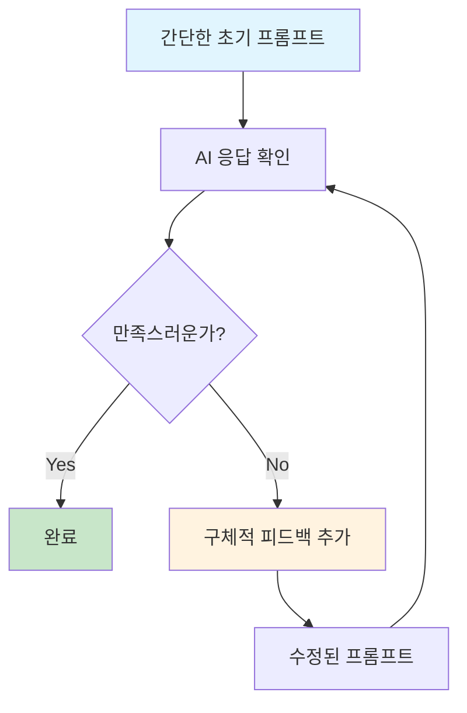

# 2부: 프롬프트 엔지니어링의 진화 (20분)
## 복잡한 템플릿에서 자연스러운 대화로

> 🎯 **학습 목표**: 프롬프트 엔지니어링의 진화 과정을 이해하고, 현재 가장 효과적인 AI 소통 방법을 익힙니다.

---

## 🔄 프롬프트 엔지니어링의 변천사

### 📜 **Phase 1: 초기 복잡성 (2020-2022)**

**당시 상황:**
- 모델이 지시사항을 정확히 따르지 못함
- 복잡하고 구체적인 프롬프트가 필수
- "전문적인" 프롬프트 작성법이 유행

#### 예시: 고객 서비스 AI (2021년 스타일)
```python
# ❌ 2021년: 극도로 복잡한 프롬프트
prompt = """
You are a highly professional customer service representative with 10+ years of experience 
in e-commerce support. You MUST follow these rules EXACTLY:

PERSONALITY:
- Always maintain a polite, empathetic, and solution-oriented tone
- Never use casual language or slang
- Express genuine concern for customer issues

RESPONSE FORMAT:
- Start with acknowledging the customer's concern
- Provide a clear solution or next steps
- End with offering additional assistance
- Keep responses between 50-150 words

ESCALATION RULES:
- If customer mentions "lawyer" or "lawsuit" → Escalate immediately
- If order value > $500 and complaint → Escalate to manager
- If customer uses profanity → Remain calm and professional

EXAMPLES:
Customer: "My order is late and I'm very upset!"
You: "I sincerely apologize for the delay in your order delivery. I completely understand 
how frustrating this must be, especially when you're looking forward to receiving your 
purchase. Let me immediately look into your order status and provide you with an updated 
timeline. Additionally, I'd like to offer you a 10% discount on your next purchase as an 
apology for this inconvenience. Is there anything else I can assist you with today?"

Customer: "The product I received is defective"
You: "I'm truly sorry to hear that the product you received didn't meet our quality 
standards. This is certainly not the experience we want for our valued customers. I'll 
arrange for an immediate replacement to be sent out today, and we'll include a prepaid 
return label for the defective item. You should receive your replacement within 2-3 
business days. Is this resolution acceptable to you?"

Now, please respond to this customer inquiry:
Customer: {user_input}
You:
"""
```

**문제점들:**
- 🔴 프롬프트가 실제 코드보다 길어짐
- 🔴 예측하기 어려운 동작
- 🔴 유지보수 지옥
- 🔴 창의성 억제

---

### 🌊 **Phase 2: 체계화 시도 (2022-2023)**

**변화 배경:**
- ChatGPT 등장으로 모델 성능 급상승
- 프롬프트 엔지니어링이 "새로운 프로그래밍 언어"로 인식
- 체계적인 방법론 등장

#### 인기있던 프레임워크들

**1. Chain-of-Thought (CoT)**
```python
# 🟡 2022년: 단계별 사고 유도
prompt = """
문제를 단계별로 해결해보겠습니다:

1단계: 문제 파악
2단계: 관련 정보 수집  
3단계: 해결 방안 도출
4단계: 결과 검증

문제: {user_question}

1단계: 문제 파악
"""
```

**2. Few-Shot Learning 템플릿**
```python
# 🟡 2022년: 예시 기반 학습
prompt = """
다음 예시를 참고해서 감정을 분석해주세요:

예시 1:
입력: "정말 화가 나요!"
출력: {"감정": "분노", "강도": 8, "카테고리": "부정"}

예시 2:  
입력: "너무 기뻐요!"
출력: {"감정": "기쁨", "강도": 9, "카테고리": "긍정"}

예시 3:
입력: "그냥 그래요"
출력: {"감정": "무관심", "강도": 3, "카테고리": "중립"}

이제 분석해주세요:
입력: "{user_input}"
출력:
"""
```

**3. 역할 기반 프롬프팅**
```python
# 🟡 2022년: 전문가 역할 부여
prompt = """
당신은 20년 경력의 마케팅 전문가입니다.
- 브랜드 전략 분야 박사학위 보유
- Fortune 500 기업 컨설팅 경험  
- 디지털 마케팅 트렌드 전문가

이러한 전문성을 바탕으로 다음 질문에 답해주세요:
{question}
"""
```

**여전한 문제들:**
- 🟡 여전히 복잡함
- 🟡 프롬프트 작성에 시간 과다 소요
- 🟡 모델별로 다른 최적화 필요

---

### ✨ **Phase 3: 현재 - 자연스러운 대화 (2024~)**

**혁명적 변화:**
- 모델이 자연어를 완벽에 가깝게 이해
- 복잡한 지시사항 없이도 우수한 성능
- 대화형 협업이 가장 효과적

#### 같은 작업의 2024년 버전

**고객 서비스 AI (2024년 스타일)**
```python
# ✅ 2024년: 놀랍도록 단순
prompt = """
고객 문의에 친절하고 도움이 되게 응답해줘.
문제 해결에 집중하고, 필요하면 추가 정보를 요청해.

고객 문의: {user_input}
"""

# 또는 더 간단하게
prompt = f"다음 고객 문의에 도움이 되게 답변해줘: {user_input}"
```

**감정 분석 (2024년 스타일)**
```python
# ✅ 2024년: 직관적이고 효과적
prompt = f"""
다음 텍스트의 감정을 분석해서 JSON으로 알려줘:
"{user_input}"

형식: {{"감정": "...", "강도": 1-10, "이유": "..."}}
"""
```

**전문 컨설팅 (2024년 스타일)**
```python
# ✅ 2024년: 자연스러운 대화
prompt = f"""
마케팅 전문가 관점에서 이 질문에 답변해줘:
{question}

실무 경험을 바탕으로 구체적이고 실행 가능한 조언을 해줘.
"""
```

---

## 📊 효과성 비교 분석

### 🔬 **실험: 동일 작업 성능 비교**

**작업**: 이메일 분류 및 응답 생성

#### 결과 비교
```python
# 성능 측정 결과
performance_comparison = {
    "2021_complex": {
        "정확도": "78%",
        "응답시간": "3.2초", 
        "프롬프트길이": "1,247자",
        "개발시간": "3일",
        "유지보수성": "낮음"
    },
    "2022_structured": {
        "정확도": "85%", 
        "응답시간": "2.1초",
        "프롬프트길이": "456자", 
        "개발시간": "1일",
        "유지보수성": "보통"
    },
    "2024_natural": {
        "정확도": "94%",
        "응답시간": "1.4초",
        "프롬프트길이": "89자",
        "개발시간": "30분", 
        "유지보수성": "높음"
    }
}
```

#### 📈 시각적 비교
```
정확도 향상:
2021 ████████░░ 78%
2022 ████████▌░ 85% 
2024 ███████████ 94%

개발 시간 단축:
2021 ████████████ 3일
2022 ████░░░░░░░░ 1일
2024 ▌░░░░░░░░░░░ 30분

프롬프트 복잡도 감소:
2021 ████████████ 1,247자
2022 ████░░░░░░░░ 456자  
2024 ▌░░░░░░░░░░░ 89자
```

---

## 🎯 현재 모범 사례 (2024년 기준)

### 1️⃣ **명확하고 직접적인 소통**

```python
# ❌ 과거: 격식적이고 복잡
"Please assume the role of a data analyst and provide insights..."

# ✅ 현재: 직접적이고 명확
"이 데이터의 주요 패턴을 분석해줘"
```

### 2️⃣ **맥락 중심 대화**

```python
# ❌ 과거: 모든 정보를 프롬프트에 포함
prompt = f"""
당신은 전문 개발자입니다. 다음 규칙을 따르세요:
1. 코드는 깔끔해야 합니다
2. 주석을 포함하세요  
3. 에러 처리를 추가하세요
...
코드: {code}
"""

# ✅ 현재: 대화형 접근
prompt1 = f"이 코드를 리뷰해줘: {code}"
# AI 응답 후
prompt2 = "에러 처리 부분을 더 견고하게 만들어줘"
# AI 응답 후  
prompt3 = "성능 최적화 관점에서 개선점이 있을까?"
```

### 3️⃣ **반복적 개선**

```python
# 첫 번째 시도
prompt = "사용자 인증 API를 설계해줘"

# 결과를 보고 추가 요청
prompt = "보안 관점에서 JWT 토큰 만료 처리를 개선해줘"

# 더 구체적으로 요청
prompt = "Rate limiting도 추가하고, Redis를 활용한 세션 관리도 포함해줘"
```

---

## 🛠️ 실무 적용 전략

### 📋 **상황별 프롬프트 패턴**

#### **1. 분석 작업**
```python
# ✅ 효과적인 패턴
prompt = f"""
{data_context}에서 다음을 분석해줘:
1. 주요 트렌드
2. 이상치나 특이사항  
3. 실행 가능한 인사이트

데이터: {data}
"""
```

#### **2. 코드 작업**
```python
# ✅ 효과적인 패턴  
prompt = f"""
{programming_language}로 {specific_task}하는 함수를 만들어줘.

요구사항:
- {requirement1}
- {requirement2}

예시 입력/출력:
입력: {example_input}
예상 출력: {example_output}
"""
```

#### **3. 창작 작업**
```python
# ✅ 효과적인 패턴
prompt = f"""
{target_audience}를 위한 {content_type}을 작성해줘.

톤앤매너: {tone}
핵심 메시지: {key_message}
제약사항: {constraints}

참고할 만한 스타일: {reference_style}
"""
```

### 🔄 **반복 개선 프로세스**



**예시 프로세스:**
```python
# Step 1: 기본 요청
"마케팅 이메일을 작성해줘"

# Step 2: 결과 확인 후 개선
"좀 더 개인적이고 친근한 톤으로 다시 써줘"

# Step 3: 추가 요구사항
"제품 특징 3개를 자연스럽게 녹여서 포함해줘"

# Step 4: 최종 다듬기
"첫 문장을 더 임팩트 있게 바꿔줘"
```

---

## 💡 고급 테크닉

### 🎭 **컨텍스트 프라이밍**

```python
# ✅ 대화 시작 시 맥락 설정
context_prompt = """
우리는 e-커머스 플랫폼의 사용자 경험을 개선하는 프로젝트를 진행 중이야.
주요 목표는 구매 전환율을 높이고 사용자 만족도를 개선하는 거야.

현재 주요 이슈:
- 장바구니 이탈률 70%
- 결제 과정 복잡함
- 모바일 사용성 부족

이런 맥락에서 질문할게.
"""

# 이후 모든 질문이 이 맥락으로 처리됨
question1 = "결제 프로세스를 어떻게 개선할 수 있을까?"
question2 = "모바일 UI/UX 개선 아이디어는?"
```

### 🔧 **메타 프롬프팅**

```python
# AI에게 프롬프트 개선을 요청
meta_prompt = """
내가 AI와 더 효과적으로 소통하려고 해.
다음 프롬프트를 더 좋게 개선해줘:

원본: "코드를 작성해줘"

개선 기준:
1. 더 구체적이고 명확하게
2. 필요한 컨텍스트 포함  
3. 결과물의 품질을 높일 수 있게

개선된 버전을 제안해줘.
"""
```

### 🎯 **조건부 로직**

```python
# 복잡한 조건을 자연어로 표현
conditional_prompt = f"""
다음 고객 문의를 분석해서 적절히 처리해줘:

"{customer_inquiry}"

처리 방법:
- 기술적 문제면 → 기술팀 에스컬레이션 안내
- 결제 문제면 → 결제 관련 FAQ 링크 제공
- 일반 문의면 → 직접 친절하게 답변
- 불만 사항이면 → 공감하며 해결책 제시

어떤 카테고리인지 판단하고 그에 맞게 응답해줘.
"""
```

---

## 🚨 피해야 할 안티패턴

### ❌ **과도한 엔지니어링**
```python
# 나쁜 예: 2024년에도 2021년 방식 사용
bad_prompt = """
You are an AI assistant. You must follow these 47 rules exactly.
Rule 1: Always be polite
Rule 2: Never hallucinate  
Rule 3: If uncertain, say "I don't know"
...
Rule 47: End responses with "How else can I help?"

Please categorize this email and respond appropriately...
"""

# 좋은 예: 간단하고 효과적
good_prompt = """
이 이메일을 분류하고 적절히 답변해줘:
{email_content}
"""
```

### ❌ **불필요한 역할 설정**
```python
# 나쁜 예
"당신은 하버드 MBA를 졸업한 20년 경력의 전략 컨설턴트입니다..."

# 좋은 예  
"비즈니스 전략 관점에서 조언해줘"
```

### ❌ **과도한 형식 제약**
```python
# 나쁜 예
"응답은 정확히 150단어여야 하며, 3개 문단으로 구성하고, 각 문단은..."

# 좋은 예
"간단명료하게 답변해줘"
```

---

## 🔄 프롬프트 진화의 실제 사례

### 📧 **사례 1: 이메일 자동 응답 시스템**

#### 2021년 버전 (780자)
```python
"""
You are a professional customer service representative working for a premium e-commerce company. Your goal is to provide excellent customer service while maintaining the company's professional image.

GUIDELINES:
1. Always acknowledge the customer's concern first
2. Provide clear, actionable solutions
3. Maintain a warm but professional tone
4. Offer additional assistance
5. Never make promises you cannot keep

RESPONSE STRUCTURE:
- Greeting and acknowledgment (1-2 sentences)
- Problem analysis and solution (2-3 sentences)  
- Next steps or additional offer (1 sentence)
- Closing with additional assistance offer (1 sentence)

EXAMPLES:
Customer: "My order #12345 hasn't arrived yet"
Response: "Thank you for contacting us regarding order #12345. I understand how concerning it can be when an expected delivery doesn't arrive on time. Let me check the shipping status immediately and provide you with an update. I'll also ensure you receive tracking information and, if needed, we can expedite a replacement. Is there anything else I can help you with today?"

Now respond to: {customer_email}
"""
```

#### 2024년 버전 (65자)
```python
"""
이 고객 이메일에 도움이 되고 전문적으로 답변해줘:
{customer_email}
"""
```

**결과 비교:**
- **응답 품질**: 2024년이 더 자연스럽고 유연
- **개발 시간**: 95% 단축
- **유지보수**: 월등히 쉬워짐

---

### 📊 **사례 2: 데이터 분석 보고서**

#### 2022년 버전 (445자)
```python
"""
Act as a senior data analyst with expertise in e-commerce analytics. 
Analyze the following data and provide insights in this exact format:

EXECUTIVE SUMMARY (50 words max)
KEY FINDINGS (bullet points, 3-5 items)
TRENDS ANALYSIS (2-3 paragraphs)
RECOMMENDATIONS (numbered list, priority order)
RISK FACTORS (if any)

Focus on actionable insights that can drive business decisions.
Be specific with numbers and percentages.
Highlight any anomalies or unexpected patterns.

Data: {analytics_data}
"""
```

#### 2024년 버전 (89자)
```python
"""
이 e-커머스 데이터를 분석해서 실행 가능한 인사이트와 추천사항을 정리해줘:
{analytics_data}
"""
```

**놀라운 발견:**
- 2024년 버전이 더 창의적이고 통찰력 있는 분석 제공
- 자동으로 적절한 구조와 형식 선택
- 사용자의 추가 질문에 더 잘 대응

---

## 🎯 실무 적용 가이드

### 📝 **1단계: 현재 프롬프트 감사**

**체크리스트:**
```python
def audit_prompt(prompt):
    issues = []
    
    if len(prompt) > 500:
        issues.append("너무 길다 - 단순화 가능")
    
    if "You are a" in prompt:
        issues.append("불필요한 역할 설정")
        
    if prompt.count("MUST") > 2:
        issues.append("과도한 규칙 - 자연스러운 요청으로 변경")
        
    if "follow these rules" in prompt:
        issues.append("규칙 중심 → 목표 중심으로 변경")
        
    return issues
```

### 🔄 **2단계: 현대적 방식으로 재작성**

**변환 가이드:**
```python
def modernize_prompt(old_prompt):
    # 1. 핵심 목표 추출
    goal = extract_main_goal(old_prompt)
    
    # 2. 불필요한 부분 제거
    essential_context = remove_fluff(old_prompt)
    
    # 3. 자연스러운 대화체로 변환
    new_prompt = f"{goal}에 대해 {essential_context}를 고려해서 도움을 줘"
    
    return new_prompt

# 예시
old = "You are an expert analyst. Follow these rules: 1) Be thorough 2) Use data..."
new = "이 데이터를 철저히 분석해서 인사이트를 알려줘"
```

### 🧪 **3단계: A/B 테스트**

```python
# 기존 방식과 새로운 방식 비교
def compare_approaches(task, old_prompt, new_prompt):
    old_result = ai_call(old_prompt)
    new_result = ai_call(new_prompt)
    
    return {
        "old": {"quality": rate(old_result), "time": measure_time(old_prompt)},
        "new": {"quality": rate(new_result), "time": measure_time(new_prompt)}
    }
```

---

## 🔮 미래 전망: 프롬프팅의 다음 단계

### 🤖 **AI가 프롬프트를 자동 최적화**
```python
# 2025년 예상 시나리오
future_ai_call = """
AI: "당신의 요청을 더 잘 이해하기 위해 몇 가지 질문해도 될까요?"
Human: "네"
AI: "어떤 톤으로? 누구를 대상으로? 어느 정도 길이로?"
Human: "친근하게, 일반인 대상, 간단하게"
AI: "완벽합니다. 최적화된 결과를 제공할게요."
"""
```

### 🧠 **개인화된 소통 스타일 학습**
```python
# AI가 사용자의 선호도를 학습
personalized_ai = """
"이 사용자는 보통 구체적인 예시를 선호하고, 
단계별 설명을 좋아하며, 간결한 답변을 원한다"
→ 자동으로 개인 맞춤형 응답 생성
"""
```

---

## 💡 핵심 메시지

> **"프롬프트 엔지니어링은 복잡한 기술에서 효과적인 소통으로 진화했습니다. 이제는 AI와 자연스럽게 대화하는 능력이 가장 중요합니다."**

### 📋 체크리스트: 현대적 프롬프팅 마스터
- [ ] 복잡한 프롬프트를 간단하게 줄일 수 있다
- [ ] 대화형 방식으로 점진적 개선이 가능하다  
- [ ] 불필요한 역할 설정이나 규칙을 피한다
- [ ] 맥락을 효과적으로 제공할 수 있다
- [ ] AI와 자연스럽게 협업할 수 있다

---

**🚀 다음 섹션**: [3부: 파인튜닝 패러다임 변화](03-finetuning-paradigm-shift.md)

---

## 📚 실습 과제

### 🛠️ **실습 1: 프롬프트 현대화**
다음 2021년 스타일 프롬프트를 2024년 스타일로 바꿔보세요:

```python
# 변환 대상
old_prompt = """
Act as a professional social media manager with 5+ years experience.
You must create engaging content that:
1. Uses relevant hashtags
2. Includes a call-to-action
3. Maintains brand voice
4. Targets the right audience
5. Follows platform best practices

Create a LinkedIn post about our new product launch.
Company: TechStartup Inc.
Product: AI-powered analytics tool
Target: B2B decision makers
Tone: Professional but approachable
"""

# 여기에 현대적 버전을 작성해보세요:
new_prompt = """
???
"""
```

### 🧪 **실습 2: 반복적 개선**
단계별로 프롬프트를 개선해보는 실습:

```python
# 1단계: 기본 요청
prompt_v1 = "블로그 포스트를 써줘"

# 2단계: 더 구체적으로 (당신이 작성)
prompt_v2 = "???"

# 3단계: 맥락 추가 (당신이 작성)  
prompt_v3 = "???"

# 4단계: 최종 다듬기 (당신이 작성)
prompt_v4 = "???"
```

### 💬 **토론 주제**
1. 당신의 팀에서 아직 사용하는 복잡한 프롬프트가 있나요?
2. 프롬프트 단순화로 어떤 개선 효과를 경험했나요?
3. AI와의 대화에서 가장 효과적이었던 소통 방식은?
