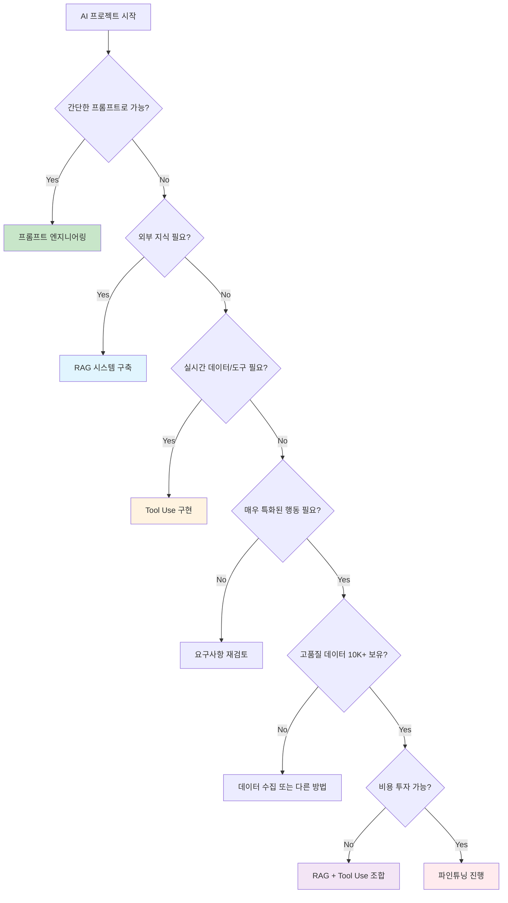

        "이유": "실시간 대량 처리, 초저지연 필요",
        "데이터": "거래 데이터 + 시장 데이터",
        "요구사항": "밀리초 단위 응답"
    }
}
```

#### 2. **최신 파인튜닝 기법 (PEFT)**
```python
# 2024년 파인튜닝: 훨씬 효율적
modern_finetuning_2024 = {
    "LoRA": {
        "파라미터": "전체의 0.1%만 훈련",
        "메모리": "90% 절약",
        "시간": "10배 단축",
        "비용": "기존의 1/20"
    },
    "QLoRA": {
        "특징": "양자화 + LoRA",
        "효과": "GPU 메모리 75% 절약",
        "성능": "풀 파인튜닝과 거의 동일"
    },
    "AdaLoRA": {
        "특징": "적응적 랭크 조정",
        "효과": "최적의 효율성",
        "자동화": "하이퍼파라미터 자동 조정"
    }
}

# 실제 구현 예시 (LoRA)
from peft import LoraConfig, get_peft_model

def efficient_finetuning():
    # LoRA 설정
    lora_config = LoraConfig(
        r=16,  # 랭크
        lora_alpha=32,
        target_modules=["q_proj", "v_proj"],
        lora_dropout=0.1
    )
    
    # 기존 모델에 LoRA 적용
    model = get_peft_model(base_model, lora_config)
    
    # 훈련 (전체 파라미터의 0.1%만)
    trainer.train()
    
    return model  # 원본 + 작은 LoRA 가중치
```

### 🔄 **하이브리드 접근법의 부상**

```python
# 2024년 추천: 여러 기법 조합
class ModernAISystem:
    def __init__(self):
        self.base_model = "claude-3.5-sonnet"  # 강력한 기본 모델
        self.rag_system = RAGSystem()          # 지식 검색
        self.tools = ToolManager()             # 외부 도구
        self.specialized_model = None          # 필요시 특화 모델
    
    def handle_request(self, user_input):
        # 1. 의도 파악
        intent = self.classify_intent(user_input)
        
        # 2. 적절한 처리 방식 선택
        if intent in ["general_chat", "simple_task"]:
            return self.base_model.generate(user_input)
            
        elif intent in ["knowledge_query"]:
            context = self.rag_system.retrieve(user_input)
            return self.base_model.generate_with_context(user_input, context)
            
        elif intent in ["action_required"]:
            return self.tools.execute_with_model(user_input, self.base_model)
            
        elif intent in ["highly_specialized"]:
            if not self.specialized_model:
                self.specialized_model = self.load_specialized_model(intent)
            return self.specialized_model.generate(user_input)
```

---

## 💡 실무 의사결정 가이드

### 🤔 **"우리 프로젝트에는 무엇이 적합할까?"**

#### 결정 플로우차트


### 📊 **ROI 계산 템플릿**

```python
def calculate_ai_approach_roi(approach, project_requirements):
    """AI 접근법별 ROI 계산"""
    
    costs = {
        "prompt_engineering": {
            "development": 50,      # 만원
            "monthly_api": 30,
            "maintenance": 10
        },
        "rag_system": {
            "development": 200,
            "monthly_api": 80,
            "monthly_infrastructure": 50,
            "maintenance": 30
        },
        "tool_use": {
            "development": 150,
            "monthly_api": 100,
            "monthly_tools": 40,
            "maintenance": 20
        },
        "finetuning": {
            "development": 500,
            "initial_training": 300,
            "monthly_inference": 150,
            "retraining": 200,  # 6개월마다
            "maintenance": 100
        }
    }
    
    # 12개월 총 비용 계산
    annual_cost = calculate_annual_cost(costs[approach])
    
    # 예상 성능 및 비즈니스 가치
    performance = get_expected_performance(approach, project_requirements)
    business_value = estimate_business_value(performance)
    
    roi = (business_value - annual_cost) / annual_cost * 100
    
    return {
        "approach": approach,
        "annual_cost": annual_cost,
        "expected_performance": performance,
        "business_value": business_value,
        "roi_percentage": roi
    }

# 사용 예시
project = {
    "domain": "customer_service",
    "complexity": "medium",
    "data_available": 5000,
    "performance_requirement": 85,
    "budget": 2000  # 만원
}

results = []
for approach in ["prompt_engineering", "rag_system", "tool_use", "finetuning"]:
    results.append(calculate_ai_approach_roi(approach, project))

# 결과 비교
best_approach = max(results, key=lambda x: x["roi_percentage"])
```

### 📋 **체크리스트: 파인튜닝 vs 대안 기술**

#### 파인튜닝을 고려하기 전 확인사항:
- [ ] 프롬프트 최적화를 충분히 시도했는가?
- [ ] RAG로 해결되지 않는가?
- [ ] Tool Use로 해결되지 않는가?
- [ ] 정말로 도메인-특화 행동이 필요한가?
- [ ] 고품질 데이터 10,000+ 보유하고 있는가?
- [ ] 초기 투자비 500만원 이상 투자 가능한가?
- [ ] 지속적인 모델 관리 리소스가 있는가?
- [ ] 성능 개선이 비즈니스에 치명적으로 중요한가?

#### 대안 기술 우선 검토사항:
- [ ] **RAG**: 최신 정보나 대량 문서 기반 답변이 필요한가?
- [ ] **Tool Use**: 실시간 데이터나 외부 시스템 연동이 필요한가?
- [ ] **하이브리드**: 복합적 요구사항으로 여러 기법 조합이 필요한가?

---

## 🚀 실습: 의사결정 시뮬레이션

### 📝 **시나리오 1: 법무팀 계약서 분석 AI**

**요구사항:**
- 계약서 리스크 자동 분석
- 95% 이상 정확도 필요
- 법률 용어 정확한 해석
- 기존 판례 참조 필요

**보유 데이터:**
- 과거 계약서 15,000건
- 관련 판례 데이터베이스
- 법률 전문가 검토 결과

**당신의 선택은?**
```python
# 여러분이 기술 리더라면?
scenario_1_choice = """
1. 프롬프트 엔지니어링
2. RAG 시스템 (판례 DB 연동)
3. Tool Use (법률 DB API 연동)
4. 파인튜닝 (계약서 특화)
5. 하이브리드 (RAG + 파인튜닝)

선택: ___
이유: ___________________
"""
```

### 📝 **시나리오 2: 스타트업 고객 지원 챗봇**

**요구사항:**
- 24시간 고객 문의 응답
- 80% 이상 정확도면 충분
- 빠른 개발 (1개월 내)
- 제한적 예산 (300만원)

**보유 데이터:**
- 고객 문의 1,500건
- FAQ 문서 50개
- 제품 사용 가이드

**당신의 선택은?**
```python
scenario_2_choice = """
1. 프롬프트 엔지니어링
2. RAG 시스템 (FAQ 기반)
3. Tool Use (티켓 시스템 연동)  
4. 파인튜닝
5. 하이브리드

선택: ___
이유: ___________________
"""
```

### 🎯 **권장 답변**

**시나리오 1**: **5번 하이브리드** (RAG + 파인튜닝)
- 이유: 높은 정확도 요구 + 충분한 데이터 + 전문 도메인

**시나리오 2**: **2번 RAG 시스템**
- 이유: 제한된 예산 + 빠른 개발 + FAQ 기반 답변

---

## 🎯 핵심 메시지

> **"파인튜닝은 '마지막 수단'이 되었습니다. 2024년에는 더 효율적이고 유연한 대안들이 대부분의 문제를 해결할 수 있습니다."**

### 📈 **패러다임 변화 요약**

```python
paradigm_shift_summary = {
    "2020-2022": {
        "주류": "파인튜닝",
        "사고방식": "우리만의 모델을 만들자",
        "비용": "높음",
        "복잡도": "높음",
        "유연성": "낮음"
    },
    "2024": {
        "주류": "RAG + Tool Use + 스마트 프롬프팅",
        "사고방식": "기존 모델을 똑똑하게 활용하자",
        "비용": "낮음",
        "복잡도": "중간",
        "유연성": "높음"
    },
    "변화의_핵심": "소유에서 활용으로"
}
```

### 📋 체크리스트: 파인튜닝 패러다임 변화 이해도
- [ ] 파인튜닝이 인기했던 이유와 현재 한계를 안다
- [ ] RAG 시스템의 원리와 장점을 이해한다
- [ ] Tool Use의 활용 방법을 안다
- [ ] 상황별 최적 기술 선택 기준을 안다
- [ ] 비용 효율성을 고려한 의사결정을 할 수 있다

---

**🚀 다음 섹션**: [4부: 현재 실무 전략](04-current-strategies.md)

---

## 📚 추가 학습 자료

### 🛠️ **실습 과제**

**과제 1: 비용 분석**
```python
# 여러분 회사의 AI 프로젝트 비용을 분석해보세요
your_project_analysis = {
    "현재_방식": "___",
    "연간_비용": "___만원",
    "성능": "___%",
    "대안_방식": "___",
    "예상_비용": "___만원",
    "예상_성능": "___%",
    "ROI_개선": "___배"
}
```

**과제 2: 기술 선택**
```python
# 다음 프로젝트들에 가장 적합한 기술을 선택하고 이유를 설명하세요
projects = [
    {
        "name": "의료 진단 보조 AI",
        "requirements": "99% 정확도, 실시간 처리",
        "data": "CT 스캔 100만장 + 전문의 판독",
        "budget": "2억원",
        "your_choice": "___",
        "reason": "___"
    },
    {
        "name": "쇼핑몰 상품 추천",
        "requirements": "개인화, 실시간 업데이트",
        "data": "구매 이력 50만건",
        "budget": "1000만원", 
        "your_choice": "___",
        "reason": "___"
    }
]
```

### 💬 **토론 주제**
1. 여러분 조직에서 파인튜닝을 고려 중인 프로젝트가 있다면, 대안은?
2. RAG vs Tool Use: 어떤 상황에서 어느 것이 더 적합할까?
3. 파인튜닝의 완전한 종말을 예상하는가, 아니면 특정 영역에서 부활할까?
