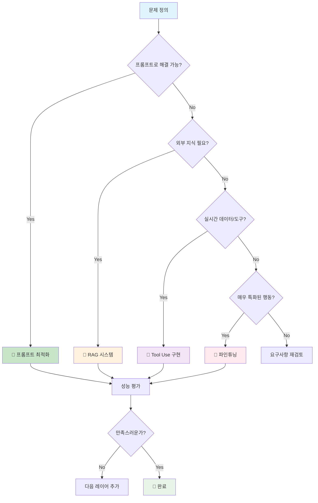
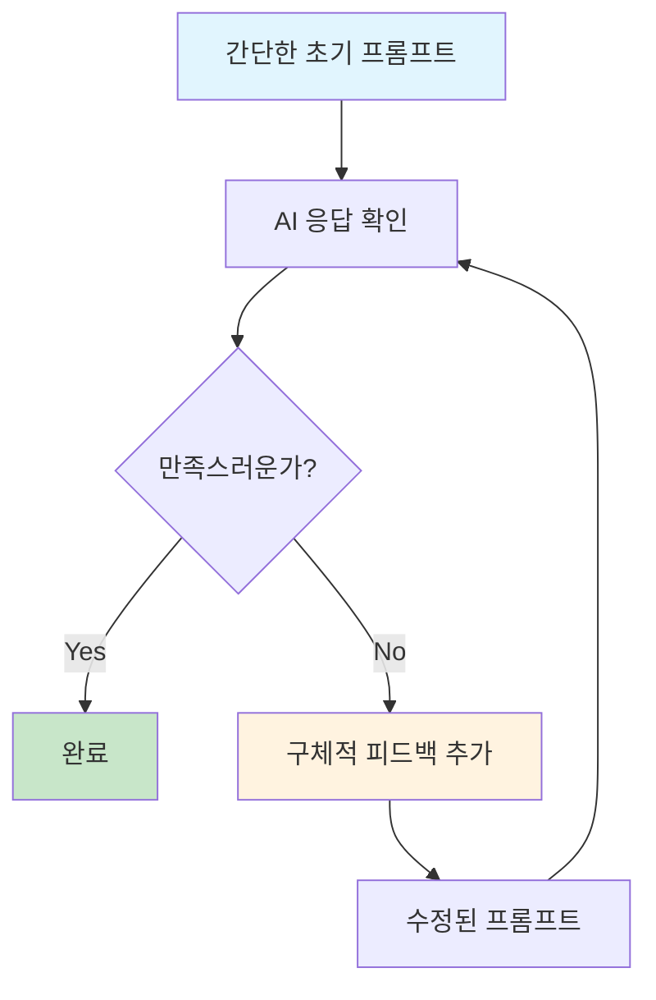

# 4부: 현재 실무 전략 (15분)
## 2024년 추천 AI 개발 스택과 단계별 접근법

> 🎯 **학습 목표**: 2024년 현재 가장 효과적인 AI 개발 전략을 이해하고, 프로젝트 상황에 따른 최적의 기술 선택 방법을 익힙니다.

---

## 🚀 **2024년 AI 개발의 새로운 공식**

### 📊 **"Layer Cake" 전략: 단계별 접근법**



---

## 🥇 **Layer 1: 스마트 프롬프팅 (80% 문제 해결)**

### 💡 **2024년 프롬프트 마스터 공식**

```python
# 🎯 현재 가장 효과적인 프롬프트 패턴
def optimal_prompt_2024(task, context, constraints=None):
    return f"""
{context}에서 {task}를 수행해줘.

{constraints if constraints else "최고 품질로 실용적이게 해줘."}

궁금한 점이 있으면 언제든 물어봐.
"""

# 실제 사용 예시들
examples = {
    "코드_리뷰": optimal_prompt_2024(
        task="이 Python 코드를 리뷰하고 개선점을 제안",
        context="프로덕션 환경에서 사용될 API 서버 코드",
        constraints="보안과 성능을 우선 고려해서"
    ),
    
    "비즈니스_분석": optimal_prompt_2024(
        task="Q3 매출 데이터를 분석해서 인사이트 도출",
        context="e-커머스 스타트업의 성장 전략 수립을 위한",
        constraints="실행 가능한 액션 아이템 중심으로"
    ),
    
    "창작_작업": optimal_prompt_2024(
        task="브랜드 스토리텔링 콘텐츠 작성",
        context="친환경 제품을 판매하는 B2C 기업의",
        constraints="MZ세대 타겟으로 진정성 있게"
    )
}
```

### 🏆 **프롬프팅 성공률 극대화 체크리스트**

```python
prompt_checklist = {
    "명확성": [
        "구체적인 작업 정의",
        "예상 결과물 명시", 
        "제약 조건 포함"
    ],
    "맥락성": [
        "충분한 배경 정보",
        "타겟 오디언스 명시",
        "목적/목표 제시"
    ],
    "실용성": [
        "실제 사용 가능한 요청",
        "현실적인 기대치",
        "측정 가능한 결과"
    ],
    "협업성": [
        "추가 질문 유도",
        "반복 개선 여지",
        "피드백 반영 가능"
    ]
}

# 성공률 측정
def measure_prompt_success_rate(prompts, criteria):
    results = []
    for prompt in prompts:
        score = evaluate_prompt(prompt, criteria)
        results.append({
            "prompt": prompt,
            "score": score,
            "success_rate": score / 10 * 100  # 90%+ 목표
        })
    return results
```

---

## 🔄 **실무 적용 전략**

### 📋 **상황별 프롬프트 패턴**

#### **1. 분석 작업**
```python
# ✅ 효과적인 패턴
prompt = f"""
{data_context}에서 다음을 분석해줘:
1. 주요 트렌드
2. 이상치나 특이사항  
3. 실행 가능한 인사이트

데이터: {data}
"""
```

#### **2. 코드 작업**
```python
# ✅ 효과적인 패턴  
prompt = f"""
{programming_language}로 {specific_task}하는 함수를 만들어줘.

요구사항:
- {requirement1}
- {requirement2}

예시 입력/출력:
입력: {example_input}
예상 출력: {example_output}
"""
```

#### **3. 창작 작업**
```python
# ✅ 효과적인 패턴
prompt = f"""
{target_audience}를 위한 {content_type}을 작성해줘.

톤앤매너: {tone}
핵심 메시지: {key_message}
제약사항: {constraints}

참고할 만한 스타일: {reference_style}
"""
```

### 🔄 **반복 개선 프로세스**



**예시 프로세스:**
```python
# Step 1: 기본 요청
"마케팅 이메일을 작성해줘"

# Step 2: 결과 확인 후 개선
"좀 더 개인적이고 친근한 톤으로 다시 써줘"

# Step 3: 추가 요구사항
"제품 특징 3개를 자연스럽게 녹여서 포함해줘"

# Step 4: 최종 다듬기
"첫 문장을 더 임팩트 있게 바꿔줘"
```

---

## 🚨 **피해야 할 안티패턴**

### ❌ **과도한 엔지니어링**
```python
# 나쁜 예: 2024년에도 2021년 방식 사용
bad_prompt = """
You are an AI assistant. You must follow these 47 rules exactly.
Rule 1: Always be polite
Rule 2: Never hallucinate  
Rule 3: If uncertain, say "I don't know"
...
Rule 47: End responses with "How else can I help?"

Please categorize this email and respond appropriately...
"""

# 좋은 예: 간단하고 효과적
good_prompt = """
이 이메일을 분류하고 적절히 답변해줘:
{email_content}
"""
```

### ❌ **불필요한 역할 설정**
```python
# 나쁜 예
"당신은 하버드 MBA를 졸업한 20년 경력의 전략 컨설턴트입니다..."

# 좋은 예  
"비즈니스 전략 관점에서 조언해줘"
```

---

## 💡 **핵심 메시지**

> **"2024년 AI 실무 전략의 핵심은 '단계적 접근'입니다. 간단한 것부터 시작해서 필요에 따라 점진적으로 복잡한 기술을 도입하는 것이 가장 효과적입니다."**

### 📋 **체크리스트: 현대적 AI 활용 마스터**
- [ ] 복잡한 솔루션보다 간단한 접근법을 우선 시도한다
- [ ] 단계별로 점진적 개선을 추구한다
- [ ] 각 단계에서 명확한 성과 측정을 한다
- [ ] 비용 대비 효과를 항상 고려한다
- [ ] 사용자 피드백을 지속적으로 수집하고 반영한다

---

**🚀 다음 섹션**: [4-2부: RAG 시스템 구축 전략](04-02-rag-systems.md)

**📚 관련 자료**:
- [프롬프트 엔지니어링 진화](02-prompt-engineering-evolution.md)
- [파인튜닝 패러다임 변화](03-finetuning-paradigm-shift.md)

---

## 📊 **간단한 ROI 계산기**

```python
# 프롬프트 최적화만으로도 얻을 수 있는 효과
prompt_optimization_benefits = {
    "개발_시간_단축": "70%",
    "API_비용_절약": "40%", 
    "결과_품질_향상": "60%",
    "유지보수_용이성": "80%",
    "투자_비용": "거의_무료"
}

print("💰 프롬프트 최적화 ROI: 즉시 적용 가능한 고효율 전략!")
```

이제 다음 파일들을 순서대로 작성하겠습니다:
- `04-02-rag-systems.md` (RAG 시스템)
- `04-03-tool-use.md` (Tool Use)
- `04-04-decision-framework.md` (의사결정 프레임워크)
- `04-05-implementation-guide.md` (실무 구현 가이드)
